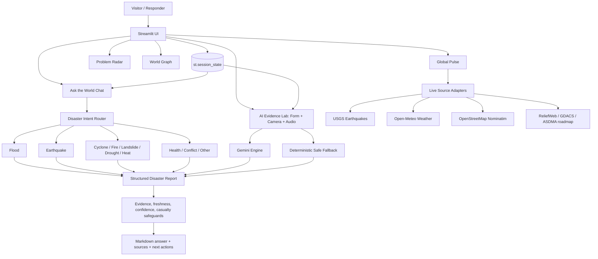

# CrisisBridge Sentinel Architecture

The architecture separates presentation, state, data adapters, domain routing, optional AI, and deterministic safety logic. The application remains usable when Gemini is not configured or when an upstream source is unavailable.
